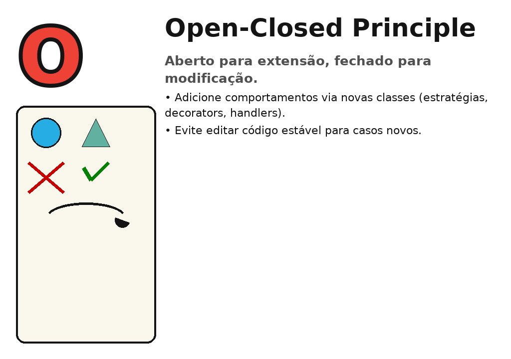
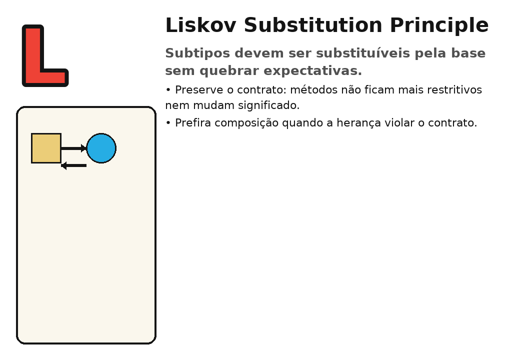
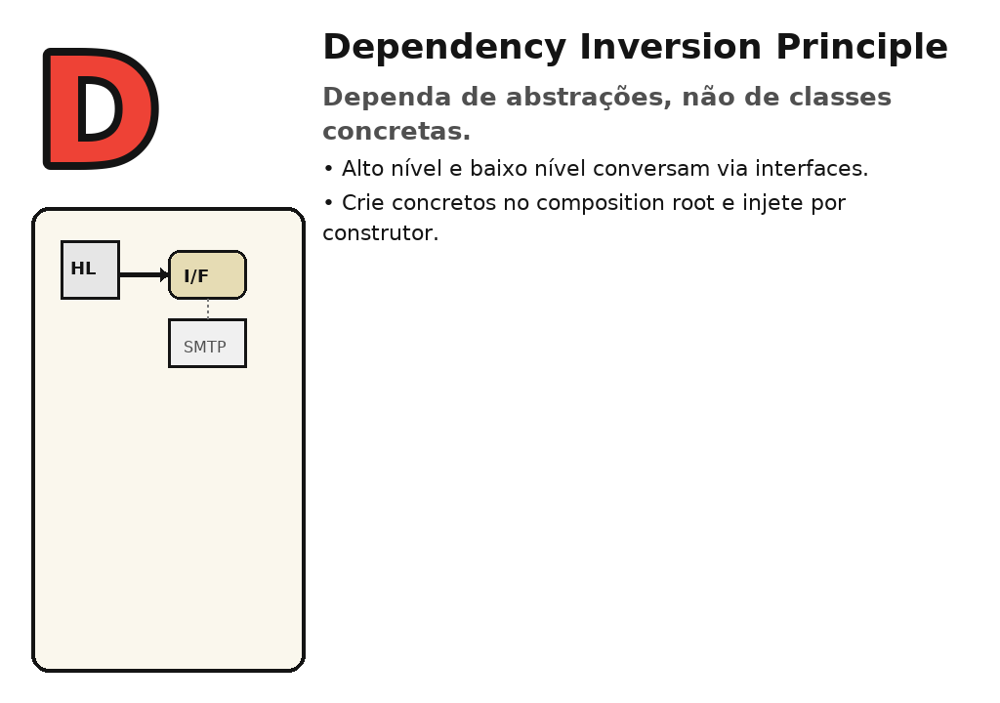

# SOLID em C# — Guia Visual

Este README reúne explicações objetivas, **mini‑figuras** (em `images/`) e **exemplos em C#** prontos para copiar/colar.

---

## S — Single Responsibility Principle (Responsabilidade Única)


**Ideia:** Cada classe deve ter **um** motivo para mudar. Separe regras de negócio de detalhes de infraestrutura.

```csharp
// ❌ Mistura regras de negócio com envio de e-mail
public class OrderService {
    public void CloseOrder(int id) { /* regra de negócio */ }
    public void SendConfirmationEmail(string to) { /* SMTP... */ }
}

// ✅ Separação de responsabilidades
public class OrderService {
    private readonly IEmailSender _email;
    public OrderService(IEmailSender email) { _email = email; }

    public void CloseOrder(int id) { /* regra de negócio */ }
    public void NotifyCustomer(string to) => _email.Send(to, "Pedido fechado!");
}

public interface IEmailSender { void Send(string to, string msg); }
public class SmtpEmailSender : IEmailSender { public void Send(string to, string msg) { /* SMTP */ } }
```

---

## O — Open/Closed Principle (Aberto/Fechado)



**Ideia:** **Abra para extensão**, **feche para modificação**. Use estratégias/handlers para novos comportamentos.

```csharp
public interface IDiscountStrategy { decimal Apply(decimal amount); }

public class NoDiscount : IDiscountStrategy { public decimal Apply(decimal a) => a; }
public class BlackFridayDiscount : IDiscountStrategy { public decimal Apply(decimal a) => a * 0.7m; }

public class Checkout {
    private readonly IDiscountStrategy _discount;
    public Checkout(IDiscountStrategy discount) { _discount = discount; }
    public decimal Total(decimal subtotal) => _discount.Apply(subtotal);
}

// Nova estratégia sem tocar no Checkout
public class LoyalCustomerDiscount : IDiscountStrategy { public decimal Apply(decimal a) => a * 0.9m; }
```

---

## L — Liskov Substitution Principle (Substituição de Liskov)



**Ideia:** Qualquer código que usa `Base` deve funcionar com `Subclasse` **sem surpresas** (contrato preservado).

```csharp
public interface ICanArea { double Area(); }

public class Rectangle : ICanArea {
    public double Width { get; }
    public double Height { get; }
    public Rectangle(double w, double h) { Width = w; Height = h; }
    public double Area() => Width * Height;
}

public class Circle : ICanArea {
    public double Radius { get; }
    public Circle(double r) { Radius = r; }
    public double Area() => Math.PI * Radius * Radius;
}

double SumAreas(IEnumerable<ICanArea> shapes) => shapes.Sum(s => s.Area());
```

> Se uma subclasse precisar *quebrar* expectativas (lançar exceção onde a base garante comportamento), re‑modele com composição ou outra interface.

---

## I — Interface Segregation Principle (Segregação de Interfaces)


**Ideia:** Prefira **interfaces pequenas**. Clientes não devem depender de métodos que não usam.

```csharp
// ❌ Interface gorda
public interface IMultiFunctionDevice {
    void Print(string doc);
    void Scan(string doc);
    void Fax(string doc);
}

// ✅ Interfaces segregadas
public interface IPrinter { void Print(string doc); }
public interface IScanner { void Scan(string doc); }

public class SimplePrinter : IPrinter {
    public void Print(string doc) { /* ... */ }
}

public class AllInOne : IPrinter, IScanner {
    public void Print(string doc) { /* ... */ }
    public void Scan(string doc)  { /* ... */ }
}
```

---

## D — Dependency Inversion Principle (Inversão de Dependência)



**Ideia:** Módulos de alto nível e baixo nível **dependem de abstrações**. Injete dependências.

```csharp
public interface IMessageSender { void Send(string to, string text); }

public class EmailSender : IMessageSender {
    public void Send(string to, string text) { /* SMTP */ }
}

public class SmsSender : IMessageSender {
    public void Send(string to, string text) { /* API SMS */ }
}

public class NotificationService {
    private readonly IMessageSender _sender;
    public NotificationService(IMessageSender sender) { _sender = sender; }
    public void Notify(string user, string msg) => _sender.Send(user, msg);
}

// Composition root
var service = new NotificationService(new EmailSender());
```

---

### Dicas rápidas (recap):
- **S**: um bloco, um propósito.
- **O**: estenda com novas classes, não edite código estável.
- **L**: subtipos não surpreendem.
- **I**: interfaces pequenas e focadas.
- **D**: injete **interfaces**; concretos na borda da app.
